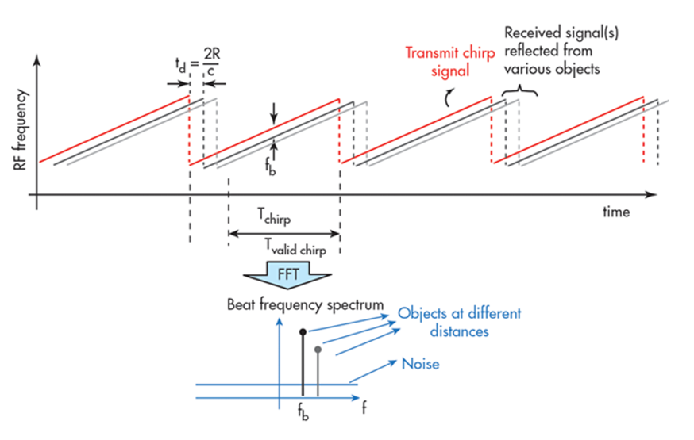
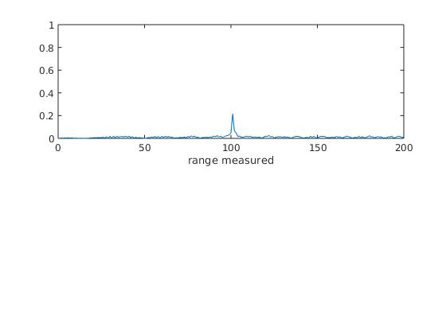
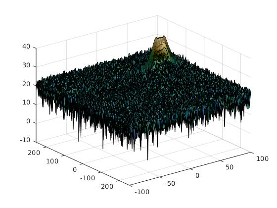
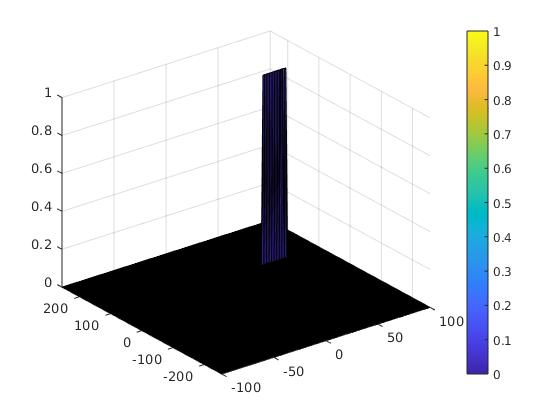

# Project Writeup
The following project layout has been implemented:


## FMCW Waveform Design
For the given system requirements, an FMCW waveform has to be designed. These
requirements are the following:


The waveform is characterized by Bandwith (Bsweep), Sweep Time (Tchirp) and
the slope of the chirp. This is done in the MATLAB code the following way:

```MATLAB
%% FMCW Waveform Generation
B = c / (2 * dres);                 % bandwith Bsweep
Tchirp = 5.5 * 2 * (Rmax / c);      % chirp time
slope = B / Tchirp;                 % slope of chirp

display(slope);
```

The resulting chirps look in general like the following example:



The calculated slope value is:

```console
slope =
    2.0455e+13
```

## Simulation Loop
In the simulation loop, a moving target has to be simulated and based on the
movement the beat or mixed signal for every timestamp has to be calculated:

```MATLAB
fc= 77e9;             %carrier freq
Nd=128;                   % #of doppler cells OR #of sent periods % number of chirps
Nr=1024;                  %for length of time OR # of range cells

t=linspace(0,Nd*Tchirp,Nr*Nd); %total time for samples

%Creating the vectors for Tx, Rx and Mix based on the total samples input.
Tx=zeros(1,length(t)); %transmitted signal
Rx=zeros(1,length(t)); %received signal
Mix = zeros(1,length(t)); %beat signal

%Similar vectors for range_covered and time delay.
r_t=zeros(1,length(t));
td=zeros(1,length(t));


%% Signal generation and Moving Target simulation
% Running the radar scenario over the time.

for i=1:length(t)         

    %For each time stamp update the Range of the Target for constant velocity.
    r_t(i) = R + v * t(i);      % based on s = v * t, mapped to range
    td(i) = 2 * r_t(i) / c;     % time delay

    % update transmit sample
    Tx(i) = cos(2 * pi * (fc * t(i) + slope * t(i)^2 / 2));                      

    % update receive sample - shifted by time delay tau
    Rx(i) = cos(2 * pi * (fc * (t(i) - td(i)) + (slope * (t(i) - td(i))^2) / 2));

    % Mix signals in timestep
    Mix(i) = Tx(i) * Rx(i);     % mixed signal

end
```

## Range FFT (1st FFT)
A 1D-FFT on the range beat signal needs to be done and plotted:

```MATLAB
%% RANGE MEASUREMENT

% reshape the linspace to 2D matrix Nr rows, Nd cols
signal_fft = reshape(Mix, [Nr, Nd]);    % reshape the linspace to 2D matrix Nr rows, Nd cols

% normalize
signal_fft = fft(signal_fft, Nr) / Nr;  % 1D FFT in Nr direction (col), normalized

% Take the absolute value of FFT output
signal_fft = abs(signal_fft);   % we are interested in the absolute value

% Output of FFT is double sided signal, but we are interested in only one side of the spectrum.
% Hence we throw out half of the samples.
signal_fft = signal_fft(1:(Nr / 2));  

%plotting the range
figure ('Name','Range from First FFT')
subplot(2, 1, 1)

 % plot FFT output
plot(signal_fft);
axis ([0 200 0 1]);
xlabel('range measured');
```

The resulting graph is depicted below, the initial position of the object is
chosen to be at 100 meters.



## 2D CFAR
For the 2D CFAR Implementation, first a doppler FFT is done to get the range
doppler matrix. This was already provided by the starter code. And produces the
following plot:




After that, the 2D CFAR is done an printed as graph, which looks the following.
The implementation steps for the 2D CFAR are described in the next sections:



### Implementation steps for the 2D CFAR process
#### 1 - Definition of Training and Guard Cells in Range and Doppler Direction
As base for the 2D CFAR, first the number of training and grad cells in range
and doppler direction need to be defined, as well as the threshold offset:

```MATLAB
Tr = 10;    % training cells for range
Td = 4;     % training cells for doppler

Gr = 8;     % guard cells for range
Gd = 4;     % guard cells for doppler

no_of_tcells = (2 * Tr + 2 * Gr + 1) * (2 * Td + 2 * Gd + 1) - ...
    (2 * Gr + 1) * (2 * Gd + 1);

offset = 10;   % threshold offset
```

You can find a short description on the selection in [this](#selection) section.

#### 2 - Loop over all measured values in the matrix
The 2D CFAR itself has been implemented in a loop, where in the indices the
number of training and guard cells have been taken into account to not "shoot"
over the edges on looping:

```MATLAB
% slide over range dimension - /2 because only one half of the signal is
% used, keep spacing at the edges
sig_CFAR = zeros(size(RDM));

for r = (Tr + Gr + 1):(Nr / 2 - (Gr + Tr))

    % slide over doppler dimension - full signal range is used, keep
    % spacing at the edges
    for d = (Td + Gd + 1):(Nd - (Gd + Td))
        ...
    end
end
```

#### 3 - Calculate average noise level of training cells in each cycle
Inside the loop, first the patch around the CUT is extracted based on the
training and guard cells. As the values of the trainings cells have to be
summed up, the guard cells and the CUT are set to 0 for now to not influence the
sum and therefor the average of all training cells:

```MATLAB
% get the patch with all training and guard cell + CUT (converted)
train_patch = db2pow(RDM(r - (Tr + Gr) : r + (Tr + Gr), d - (Td + Gd) : d + (Td + Gd)));

% zero CUT and guard cells as we are not interested in these now
train_patch(Tr + 1 : end - Tr, Td + 1 : end - Td) = 0;

% average summed values for used training cells and convert back
% pow2db
noise_level = pow2db(sum(sum(train_patch)) / no_of_tcells);
```

#### 4 - Offset the noise level
The resulting noise level is then offset by the previously defined value. All
range doppler values above the threshold lead to a CFAR signal of 1, all others
to 0:

```MATLAB
% add the offset to determine the threshold
threshold = noise_level + offset;

% compare signal under CUT with threshold --> 0 or one
if RDM(r, d) < threshold
    sig_CFAR(r, d) = 0;
else
    sig_CFAR(r, d) = 1;
end
```


### Selection of Training, Guard cells and offset {#selection}
For the CFAR, the number of training and guard cells around the cell
under test (CUT) in both, range and doppler direction, have been chosen with a
trial and error approach, checking how the 2D CFAR result looks like in the
diagram and selecting the most valuable values. The same has been done for the
offset value. A good way was to use a starting point out of the lesson and
manipulating the values step by step towards a good result.

The final values are:
* Training cells in range direction: 10
* Training cells in doppler direction: 4
* Guard cells in range direction: 8
* Guard cells in doppler direction: 4
* Threshold offset: 10

### Steps taken to suppress the non-thresholded cells at the edges {#suppress}
Because the loops are not covering all values on the given matrix, there may be
false positives at the edges. To suppress these, all the cells that have never
been considered as CUT are set to zero. This is done by selecting patches at
the matrix edges based on the training and guard cells in both directions
statically:

```MATLAB
% the not handled values are a boarder of training + guard cell
sig_CFAR(1 : Nr / 2, 1 : Td + Gd) = 0;          % front cols
sig_CFAR(1 : Nr / 2, Nd - (Td + Gd) : Nd) = 0;  % back cols
sig_CFAR(1 : Tr + Gr, 1 : Nd) = 0;                  % top rows
sig_CFAR(Nr / 2 - (Tr + Gr) : Nr / 2, 1 : Nd) = 0;  % bottom rows
```
